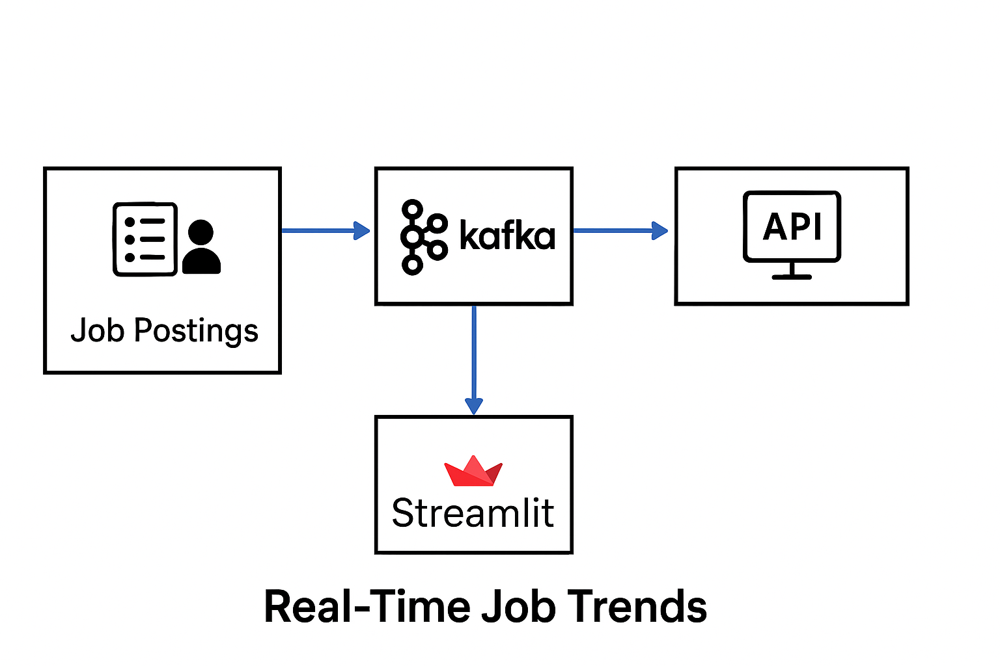

# JSearch - Real-Time Job Market Data Pipeline

This repository contains the Phase 1 scaffold for JSearch: a real-time job market data
ingestion pipeline that collects job postings from public APIs (RemoteOK, Adzuna),
normalizes them, and pushes to Kafka for downstream processing.

## Structure


- src/collectors: API collectors for RemoteOK and Adzuna
- src/utils: helper utilities (Kafka producer)
- docker-compose.yml: local Kafka + Zookeeper
- .env.example: sample environment variables

## Quickstart
1. Copy `.env.example` to `.env` and fill in API keys.
2. Start local Kafka:
   ```
   docker-compose up -d
   ```
3. Install dependencies:
   ```
   pip install -r requirements.txt
   ```
4. Run collectors:
   ```
   python -m src.main
   ```

